# Allocation of Payroll Protection Plan Funding under $150k during COVID and its Effect in Colorado

## Motivation and Background:
COVID-19 has affected all of our lives, especially the small businesses in our communities. The Government's solution was to offer Payroll Protection Funding in order to try to save those small businesses, and the people's jobs who work there.

In the current political and ethical climate of the US, equity and equality have taken a front seat in the public's minds. When looking at the ethnic distribution in Colorado, it is very clear that the Hispanic community is prominent in the makeup. As such, it is important to take a look at whether or not the distribution of  accurately represents the distribution of all ethnicities across the population of Colorado.

The Payroll Protection Plan dataset is specific to Colorado's distribution of Small Business loans and comes from the US Small Business Administration. It includes all loans under $150k. I have also used the US Census data for the demographics, and a small dataset that lists all zip codes and the counties they belong to.

I have a few questions I would like to answer with this data:

- What does the average loan amount look like for each ethnicity in Colorado? 
- Where are these loans being taken out? Is there a specific county that stands out?
- What do the demographics of those counties look like? 

My ultimate goal is to determine whether or not there is a disparity between the loan allocation and the population in Colorado across all ethnicities provided in the dataset.

## Data Cleaning:

This dataset comes from the Small Business Administration which includes information about the loan provided to small businesses in Colorado. This data came in the form of a csv with information including: loan amount, county, zip code, business type, NAICS code (industry each business belongs to), Race/Ethnicity, Gender, number of jobs retained, and lender. 

The full list of columns included:

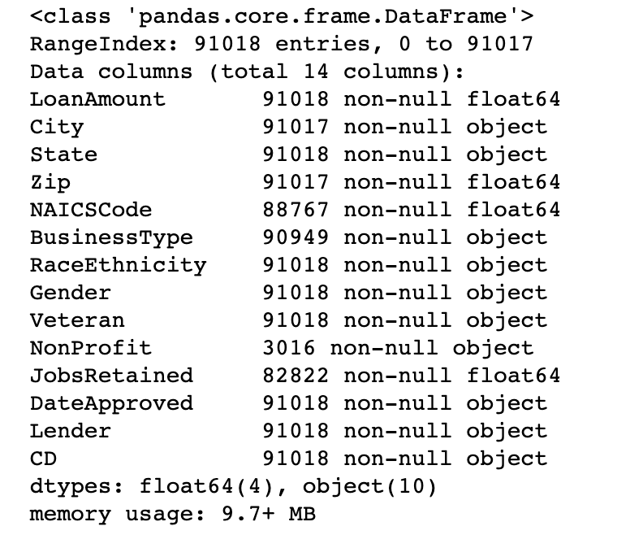

Since much of this information was self-reported by the borrowers, the majority of the data included unanswered fields. For my analysis that is largely based on the Ethnic makeup of the data, I excluded only the rows of data that did not include an ethnicity.

This dataset is comprised of 91018 rows, 84247 of which have an unanswered ethnicity. I decided to use the original data and eliminate all unanswered ethnicity fields which leaves 6771 rows to work with. 

The raw Payroll Protection Data looks like this: 

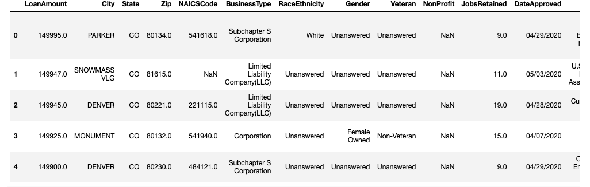

Important cleaning steps: **(picture of data for context? pic of form people have to fill out??) 

- Drop NonProfit columns
- Isolate answered Ethnicities
- Merge in Zip Code/County data so I could group the data by County
- Only include 2018 from the US Census data

After eliminating the rows with an unanswered ethnicity and the other data cleaning steps listed above:

Hispanic data:

Asian data:

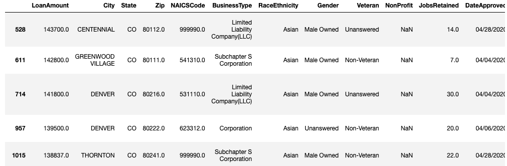

## EDA: 

Before focusing in on the specific comparisons, I decided to look at the 6700 rows of data in the form of a scatter matrix to see if there are any glaring correlations between columns. 

Demographics in Colorado:

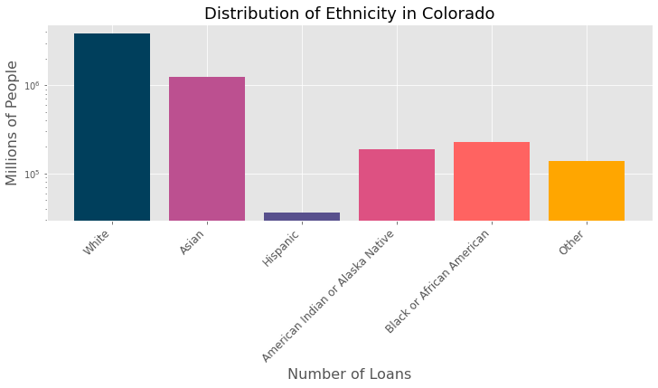

Comparison of average loan amount for each ethnicity:

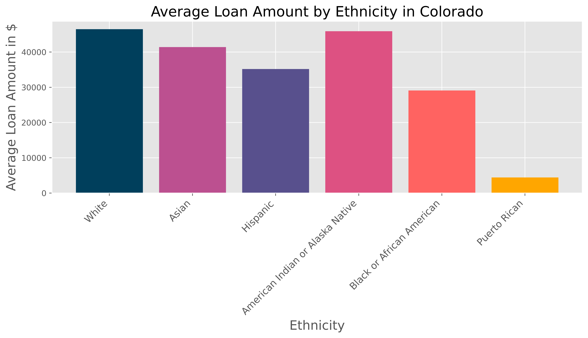

Comparison of total loan amount for each ethnicity (*NOTE: The amounts are scaled to see the differences, the White population loan total is vastly larger than the rest of the ethnicities):

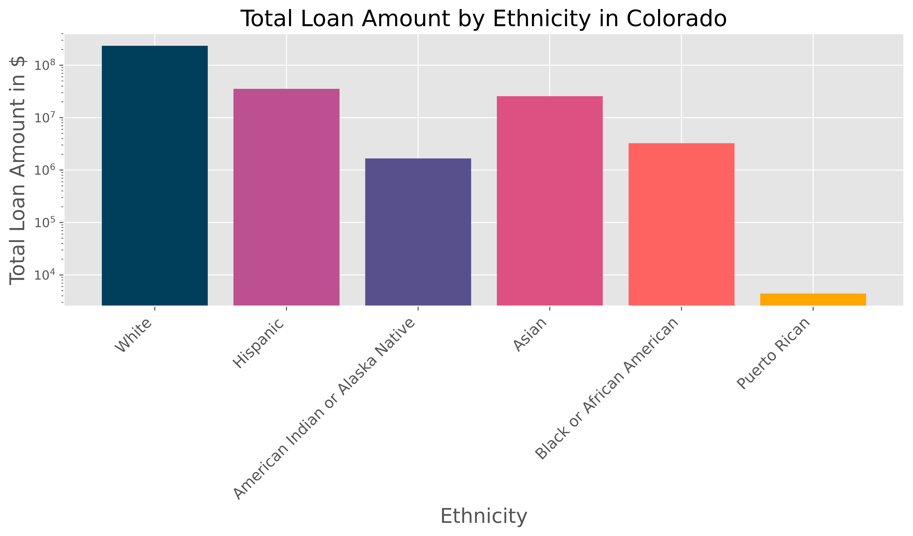

Here is the graph of total loan amounts without scaling:

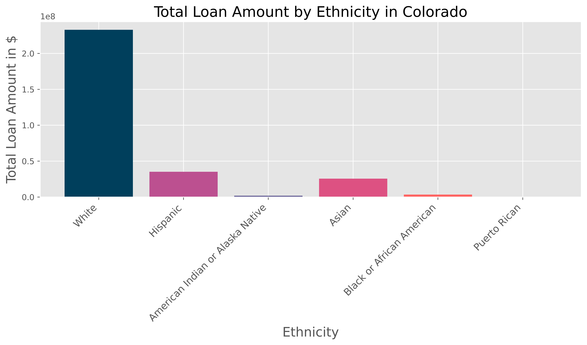

Top Counties for Number of Loans:

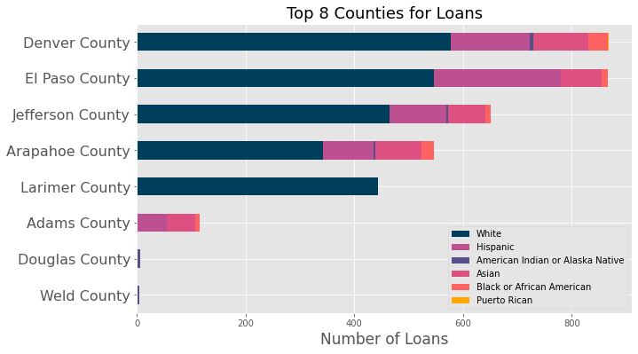

Top 8 Counties for Total Loan Amount:

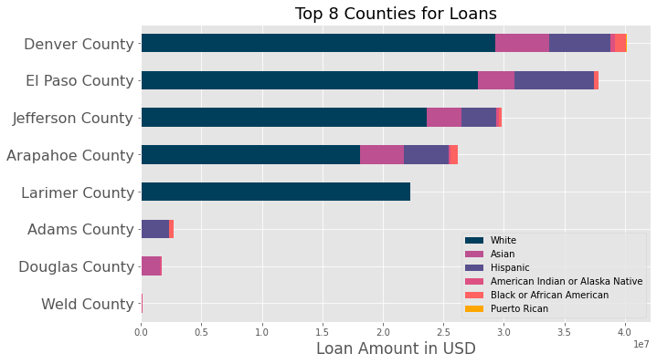

Top Counties Demographics:

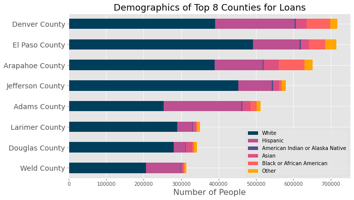

Comparison of Loan Amount and Jobs Retained:
For this comparison, I dropped all rows in which the Jobs Retained field was unanswered.
The ethnicities are color coded with the overall average specified as an X.

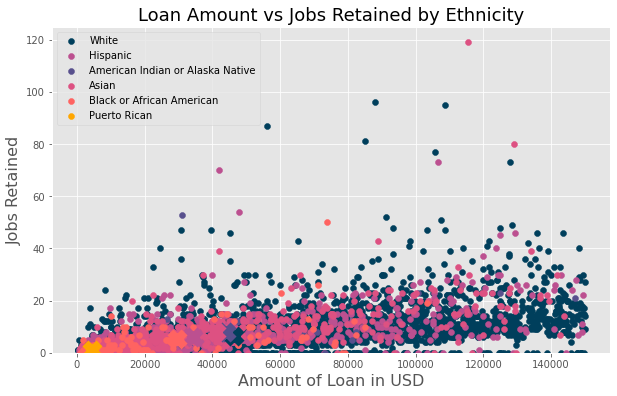

## Results:
Since such a small portion of borrowers actually reported their ethnicity, the results are a very small representation of the full population. 

Looking at the 6700 records that do include ethnicity, you can see that the full demographics 

## Future Work:
If the records of the respective ethnicity Chamber of Commerce could be obtained and compared to the payroll data to help fill in ethnicity, the data can be examined in a more full capacity.

With more time, it would be nice to visualize where the loans are being taken out on a map. I would make a heat map, colored for ethnicity according to the most loans taken out in those zip codes.  

I could also pull in some more information about the demographic makeup of industries in colorado and compare that to the Payroll Protection Data, paying close attention to if there are any Fortune 500 companies on the list. 

I would love to do a comparison of gender.

Compare the loans by county to the COVID outbreak data to see if certain areas were hit harder than others. 

## References:
Small Business Administration,  US Census Data from 2018, Sandra Halvatzis

