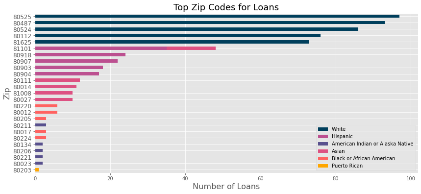

# Allocation of Government Resources during COVID and its Effect in Colorado

## Motivation and Background:

In the current political and ethical climate of the US, equity and equality have taken a front seat in the public's minds. When looking at the ethnic distribution in Colorado, it is very clear that the Hispanic community is prominent in the makeup of our community. As such, it is important to take a look at whether or not the distribution of government resources accurately represents the distribution of all ethnicities across the population of Colorado.

Our class was approached by a consultant working for the Hispanic Chamber of Commerce who was trying to create a story about COVID-19's effect on the Hispanic community of Colorado. She provided a dataset that detailed Colorado's dispursement of Payroll Protection Loans.

I have a few questions I would like to answer:

- What does the average loan amount look like for each ethnicity in Colorado? 
- Where are these loans being taken out? Is there a specific county that stands out?
- What do the demographics of those counties look like? 
- What types of businesses are recieving loans? Do they belong to the Fortune 500 list? Are there certain industries that are recieving more than others? 
 - Does gender come into play at all?

The dataset is specific to Colorado's distribution of Small Business loans and comes from the US Small Business Administration. I have also used the US Census data for the demographics, and a small dataset that lists all zip codes and the counties they belong to.

My ultimate goal is to determine whether or not there is a disparity between the loan allocation and the population in Colorado across all ethnicities provided in the dataset.

## Data Cleaning:

This dataset comes from the Small Business Administration which includes information about the loan provided to small businesses in Colorado. This data came in the form of a csv with information including: loan amount, county, zip code, business type, NAICS code (industry each business belongs to), Race/Ethnicity, Gender, number of jobs retained, and lender. 

Since much of this information was self reported by the payees of the loans, the majority of the data included unanswered fields which were excluded.

The clean_data.py script was used in order to clean the data for my EDA. 

This dataset is comprised of 91018 rows, 84247 of which have an unanswered ethnicity. I decided to use the original data and eliminate all unanswered ethnicity fields which leaves 6771 rows to work with. 

The raw Payroll Protection Data looks like this: 

Important cleaning steps: **(picture of data for context? pic of form people have to fill out??) 

- Drop NonProfit columns
- Isolate answered Ethnicities

After eliminating the rows with an unanswered ethnicity and the other data cleaning steps listed above:

## EDA: 

Before focusing in on the specific comparisons, I decided to look at the 6700 rows of data in the form of a scatter matrix to see if there are any glaring correlations between columns. 

Demographics in Colorado:

Comparison of average loan amount for each ethnicity:

Top Zip Codes for Loans:

Top Counties for Loans:

Top Counties Demographics:

## Results:
Since such a small portion of borrowers actually reported their ethnicity, the results are a very small representation of the full population. 

Looking at the 6700 records that do include ethnicity, you can see that the full demographics 

## Future Work:
If the records of the respective ethnicity Chamber of Commerce could be obtained and compared to the payroll data to help fill in ethnicity, the data can be examined in a more full capacity.

## References:
Small Business Administration,  US Census Data from 2018, Sandra Halvatzis

